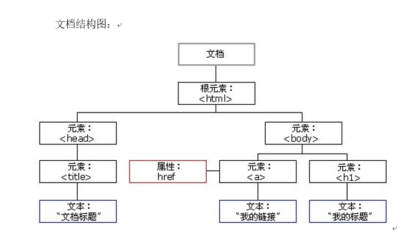
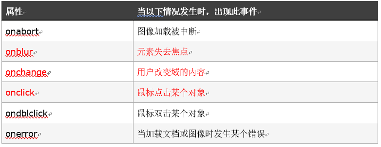
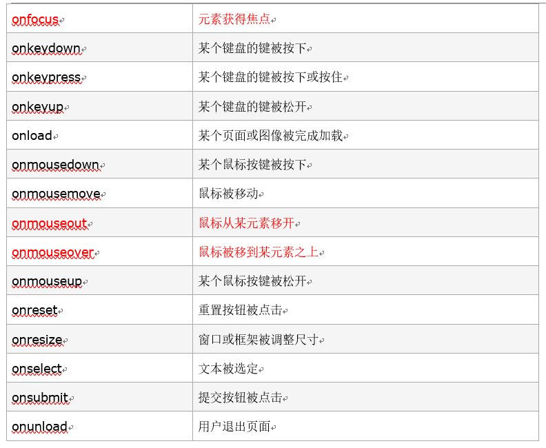

# js与DOM元素的不解之缘

## DOM的数据结构(树状)

> + HTML的组成部分为节点(Node)
> 
> 在HTML中一切都是节点
> 
> 由结构图中我们可以看到,整个文档就是一个文档节点.
> 
> 每一个HTML标签都是一个元素节点.
> 
> 标签中的文字则是文字节点.
> 
> 标签的属性是属性节点.

> + DOM节点的获得
> 
> 操作节点,必须首先找到该元素.有三种方法来做这件事:
> 
> document.getElementById("标签的id名");
> 
> 最准确的获取DOM元素的方法,通过标签的id名来绑定DOM元素.
	
	<body>
		

		
		

		
	</body>

> document.getElementsByClassName("标签的class名");
> 
> 通过标签的class名来绑定DOM元素.
> 
> 注意class名的数量,Elements,获得的是个类数组,需要通过[]提取其中的一项.
> 
> 通过类名查找元素在IE5,6,7,8中无效

	<body>
		

		
		

		
	</body>

> document.getElementsByTagName("标签的名称");
> 
> 通过标签的名称来绑定DOM元素.
> 
> 效率低,没办法定位元素,注意标签的数量,Elements,获得的是个类数组,需要通过[]来获得其中的一项.

	<body>
		

		
		

		
	</body>

> + 通过其他节点获得节点
> DOM的节点并不是孤立的,因此可以通过DOM节点之间的相对关系对它们进行访问.
> 
> 节点的访问关系,是以属性方式存在的.
> + 父节点(parentNode)
> 
> 调用者就是节点.一个节点只有一个父节点.调用方式是(节点.parentNode)

	<body>
		

			

		
			

		

		
	</body>

先通过类名绑定box2,然后通过box2来绑定box2的父节点即box.

> + 兄弟节点(nextSibling | nextElementSibling)
> 
> nextSibling,调用者就是节点.(存在浏览器兼容问题)
> 
> IE6,7,8中指下一个元素节点(标签,注释).在火狐,谷歌,IE9+都指的是下一个节点(包括空文档和换行节点).
> 
> nextElementSibling,在火狐,谷歌,IE9+都指的是下一个元素节点.
>
>在IE6,7,8中用nextSibling.在火狐,谷歌,IE9+用nextElementSibling
>
>兼容的写法:nextEle = Node.nextElementSibling || NodeSibling
>
>兼容写法位置不能互换
	
	<body>
		

			

		
			

			

			

		

		
	</body>
	
> 例子中通过nextElementSibling || nextSibling来获取向下相邻的兄弟节点id为box3的div,考虑到兼容性,用逻辑或来实现.

> + 兄弟节点(previousSibling | previousElementSibling)

>previousSibling: 调用者是节点.IE6,7,8中指前一个元素节点(标签).在火狐,谷歌,IE9+以后都指的是前一个节点(包括空文档和换行节点).

>previousElementSibling: 在火狐,谷歌和IE9+中都指的是前一个元素节点.

>在IE6,7,8中用previousSibling,在火狐,谷歌,IE9+中用previousSibling.
>
>用法同上面相同,指向上一个兄弟节点.

> + 单个子节点

>fistChild: 调用者是父节点.IE6,7,8中指第一个子元素节点(标签).在火狐,谷歌,IE9+中都指的是第一个节点(包括空文档和换行节点).

>firstElementChild: 在火狐,谷歌,IE9+中都指的是第一个元素节点.

>lastChild: 调用者是父节点.IE6,7,8中都指的是最后一个元素节点(标签).在火狐,谷歌.IE9+中都指的是最后一个节点(包括空文档和换行节点).

>lastElementChild: 在火狐,谷歌,IE9+中都指的是最后一个元素节点.

> + 所有子节点

>childNodes: 它是标准属性,返回所有指定元素的子元素集合,包括HTML节点,所有属性,文本节点.(他还是W3C的亲儿子)????

>火狐,谷歌,IE高版本会把换行也看做是子节点

>children: 非标准属性,它返回指点元素的子元素集合.

>它只返回HTML节点,甚至不反回文本节点,虽然不是标准的DOM属性,但它和innerHTML方法一样,得到了几乎所有浏览器的支持.

>children在IE6,7,8中包含注释节点

>处理子节点的浏览器兼容问题

	function MyChildren(Node){
		var myChildrenArr = [];
		var childrenArr = Node.children;
		for(var i in childrenArr){
			if(childrenArr[i].nodeType == 1){
				myChildrenArr.push(childrenArr[i]);
			}		
		}
		return mychildrenArr;
	}

>节点的nodeType方法可以返回一个数值.

>nodeType == 1 时表示的是元素节点(元素就是标签)

>nodeType == 2 时表示的是属性节点

>nodeType == 3 时表示的是文本节点

>nodeType == 8 时表示的是注释节点

### DOM节点操作.
> 
> 节点的访问关系都是属性,节点的操作都是函数或者方法.
> 
> + 创建节点

>使用的方法是document.createElement()

	document.createElement("div");

> 例子创建了一个div标签,但是并没有放在body里,需要通过其他方法添加进去.

> + 插入节点

> 使用方法: 父节点.appendChild(要添加的节点)

> 在父节点下添加一个节点到子节点的最末.

> 使用方法: 父节点.insertBefore(要添加的节点,参考节点)

>如果参考节点为null,那么它将在节点最后插入一个节点.

> + 删除节点

> 使用方法: 父节点.removeChild(子节点).

>通过父节点删除

>不知道父级的情况下可以这样写: 要删除的节点.parentNode.removeChild(要删除的节点).

>通过parentNode来找到父节点,然后再通过父节点来删除子节点.

> + 复制节点

> 使用方法: 原本的节点.cloneNode(true).返回一个复制后的节点.

> 这个函数可以传入参数,如果是true,深层复制,如果是false,只复制节点本身(标签).

> + 节点属性

> 获取方法: 节点.getAttribute(属性名称)

> 设置方法: 节点.setAttribute(属性名称,属性值)

> 删除方法: 节点.removeAttribute(属性名称)

### value 和 innerHTML和innerText和textContent

> 老版本的火狐不支持innerText,支持textContent

> value只对表单有效果,是属性.

> innerHTML插入可执行的标签,标签和样式会被解析,常用于动态生成页面元素.

> innerText插入文本内容,标签和样式会被当做文本内容处理.

> + 事件表

